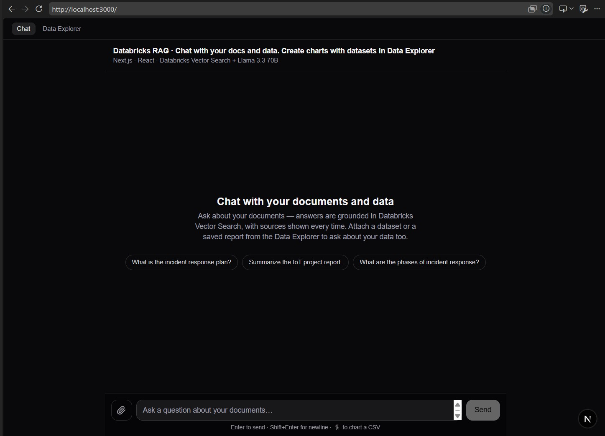
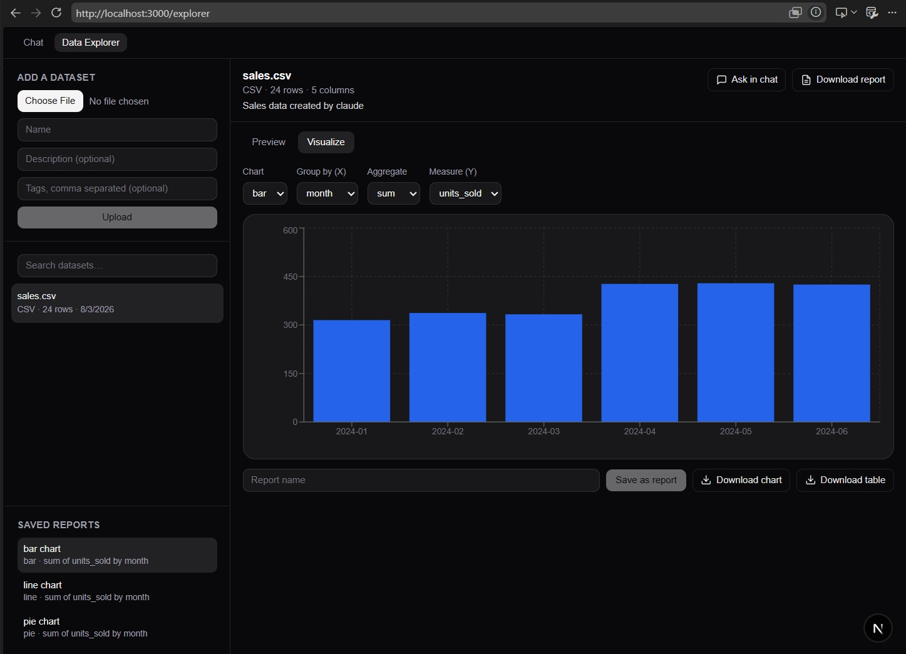

# Databricks RAG · Chat with your docs and data

Two halves of one app, sharing a Databricks backend:

- **Chat** (`/`) — an agentic retrieval-augmented-generation chat over your own
  documents. The model drives its own retrieval through a `search_documents`
  tool — calling it once, several times with a sharper query, or not at all —
  before streaming a grounded, cited answer token-by-token. Retrieval runs on
  **Databricks Vector Search**; generation and tool-calling on a **Databricks
  Foundation Model serving endpoint** (Llama 3.3 70B). You can also attach a
  CSV and ask questions about it — the model plans, the browser computes.
- **Data Explorer** (`/explorer`) — upload datasets to a **Unity Catalog
  Volume**, page through a typed preview, build bar/line/pie charts, save charts as
  named reports, and download a chart as PNG or a full PDF report. No cluster
  or SQL warehouse required.

The two halves cross-link: a CSV attached in chat lands in the Explorer
catalog, and any Explorer dataset or report can be opened back in chat via an
"Ask in chat" deep link.

Frontend is **Next.js 16 (App Router) + React 19**.

---

## Screenshots

**Chat** (`/`) — grounded answers over your documents, with suggested prompts and
a paperclip to attach a CSV or a saved report.



**Data Explorer** (`/explorer`) — upload a dataset, preview it, build a chart,
and save it as a named report. "Ask in chat" opens it back in the chat tab.



---

## Architecture

```
┌──────────────────────────────────────────────────────────────┐
│  Browser (React 19)                                          │
│  Chat: ChatWindow / MessageList / useChat()                  │
│  Explorer: ExplorerShell / PreviewTable / ChartBuilder       │
└───────┬──────────────────────┬───────────────────────────────┘
        │ /api/chat (streamed) │ /api/datasets, /api/reports, /api/data
        ▼                      ▼
┌──────────────────────────────────────────────────────────────┐
│  Next.js Route Handlers (server, Node runtime)               │
│  Backend-for-frontend — holds the Databricks PAT             │
│                                                               │
│  /api/chat      1. agent loop: model calls search_documents   │
│                    (rerank + relevance floor run inside the   │
│                    tool) until satisfied, or a 5-iter cap     │
│                 2. stream the final answer over the full      │
│                    tool-call conversation, no tools attached  │
│                 3. line 1 = sources JSON, then answer tokens  │
│  /api/data      LLM *planner* — returns a JSON envelope       │
│                 describing what to compute, never the numbers │
│  /api/datasets  Files API CRUD over the Volume + catalog.json │
│  /api/reports   Saved chart configs in reports.json           │
└──────────────────────────────┬───────────────────────────────┘
                               ▼
┌──────────────────────────────────────────────────────────────┐
│  Databricks Free Edition                                      │
│  • Delta table  rag_demo.docs.doc_chunks  (chunked docs)      │
│  • Vector Search Delta Sync index (GTE embeddings)            │
│  • Foundation Model endpoint: databricks-meta-llama-3-3-70b   │
│  • UC Volume: dataset files + catalog.json + reports.json     │
└──────────────────────────────────────────────────────────────┘
```

Three design invariants worth knowing:

- **Retrieval is agent-driven, not a fixed pipeline.** The model itself
  decides when to call `search_documents`, how to phrase the query, and
  whether to re-search — up to a 5-iteration cap (`lib/agent.ts`). Reranking
  and a relevance floor run *inside* the tool (`lib/tools.ts`), so every
  result the model sees back is already quality-filtered; it never touches
  raw vector-search hits directly.
- **Databricks-computed embeddings.** The Delta Sync index embeds documents and
  queries with the same GTE model server-side, so the app queries Vector Search
  with plain **text** and never calls an embedding model itself. Two REST calls
  per question: retrieve, then generate.
- **The model never does arithmetic.** For data questions, `/api/data` hands the
  model only the schema plus a small sample and asks *what* to do; it replies
  with a `chart` / `compute` / `text` envelope. The browser executes that
  envelope against the rows it holds (`lib/csv.ts`), so every figure is exact.
  The Explorer's server-side `/aggregate` route follows the same rule — it
  groups and aggregates the real rows in Node.

---

## Tech stack

| Layer         | Tech                                                          |
| ------------- | ------------------------------------------------------------- |
| UI            | React 19 components, Tailwind CSS v4                          |
| Framework     | Next.js 16 (App Router, Route Handlers)                       |
| Streaming     | Custom `useChat` hook over `fetch` + `ReadableStream`         |
| Retrieval     | Databricks Vector Search (Delta Sync index, GTE embeddings)   |
| Generation    | Databricks Foundation Model API — Llama 3.3 70B (streaming)   |
| Dataset store | Databricks Files API over a Unity Catalog Volume (no compute) |
| Parsing       | papaparse (browser and Node)                                  |
| Charts        | Recharts (Explorer), Chart.js (in-chat chart messages)        |
| Export        | Hand-rolled SVG→canvas rasterizer; jsPDF + jspdf-autotable    |
| Data prep     | Databricks notebook: load → chunk → Delta table → index       |

---

## Project structure

```
app/
  api/
    chat/route.ts               BFF: run the agent loop, then stream the answer
    data/route.ts               LLM planner → {chart|compute|text} envelope
    datasets/route.ts           GET search catalog · POST upload (5 MB cap)
    datasets/[id]/route.ts      GET metadata + a page of parsed rows · DELETE
    datasets/[id]/aggregate     Group-by + aggregate over the real rows
    datasets/[id]/download      Always CSV (JSON datasets are flattened)
    reports/route.ts            GET all · POST save a chart config
    reports/[id]/route.ts       DELETE
  components/
    TopNav.tsx                  Chat ↔ Data Explorer
    ChatWindow.tsx              Wires the hook to the UI; consumes deep links
    MessageList.tsx             Message stream + auto-scroll + empty state
    MessageBubble.tsx           User/assistant bubbles, streaming cursor
    ChartMessage.tsx            Chart.js chart rendered inside a message
    ChatInput.tsx               Auto-growing textarea, CSV attach, Enter-to-send
    Sources.tsx                 Collapsible retrieved-chunk citations
  hooks/useChat.ts              Conversation state, stream consumption,
                                attachDataset / openCatalogDataset / openReport
  explorer/
    page.tsx                    /explorer route
    components/
      ExplorerShell.tsx         Three-pane layout + shared state
      UploadPanel.tsx           Name, description, tags, file
      CatalogList.tsx           Searchable dataset list
      DatasetView.tsx           Header, "Ask in chat", "Download report"
      PreviewTable.tsx          Paged (50/page), type-badged preview
      ChartBuilder.tsx          Chart type / x / y / agg, save, export
      ReportsList.tsx           Saved reports; active one is highlighted
  page.tsx / layout.tsx         Shell; reads ?dataset= / ?report=
lib/
  databricks.ts                 Server-only Databricks REST client
  agent.ts                      ReAct-style loop: offer search_documents until
                                 the model stops requesting it, or a 5-iter cap
  tools.ts                      Tool registry — search_documents wraps
                                 retrieve + rerank + relevance floor
  rag.ts                        Rerank + relevance-floor stages used by tools.ts
                                 (condenseQuery/runRetrievalPipeline: unused now)
  volume.ts                     Server-only Files API client over the Volume
  catalog.ts                    Dataset + report index (JSON in the Volume)
  table.ts                      Server-side parse, type inference, aggregate, toCsv
  csv.ts                        Browser-side parse, summarize, aggregate, compute
  chart-types.ts                Chart vocabulary shared by client and server
  chart-export.ts               SVG → canvas → PNG (with painted legend)
  report-pdf.ts                 Title block + chart image + data table → PDF
```

---

## Setup

### 1. Databricks backend (one-time, in a Databricks notebook)

The notebook pipeline: load documents from a Unity Catalog Volume → chunk them →
write a Delta table `rag_demo.docs.doc_chunks` (with Change Data Feed enabled) →
create a Vector Search endpoint → create a Delta Sync index using the
`databricks-gte-large-en` embedding endpoint.

For the Data Explorer, create one more Volume to hold dataset files and the two
JSON index files (`catalog.json`, `reports.json`). Nothing else is needed — the
Files API works on Volumes without a running cluster or SQL warehouse.

### 2. Environment

`.env.local` (already gitignored — never committed):

```bash
DATABRICKS_HOST=https://<your-workspace>.cloud.databricks.com
DATABRICKS_TOKEN=<personal-access-token>
DATABRICKS_VS_ENDPOINT=rag_demo_endpoint
DATABRICKS_VS_INDEX=rag_demo.docs.doc_chunks_index
DATABRICKS_CHAT_ENDPOINT=databricks-meta-llama-3-3-70b-instruct
DATABRICKS_VOLUME_DATA_EXPLORER=/Volumes/rag_demo/docs/data_explorer

# RAG pipeline tuning (all optional — defaults shown)
# Only these three are read on the current agent path (inside the
# search_documents tool, lib/tools.ts → lib/rag.ts):
RAG_RERANK=1               # 0 disables LLM reranking (also disarms the floor)
RAG_RERANK_CONCURRENCY=3   # parallel scoring calls; lower further if you hit 429s
RAG_MIN_RERANK_SCORE=2     # 0-10 floor; chunks below this are dropped

# RAG_QUERY_REWRITE, RAG_CANDIDATE_POOL, RAG_TOP_K and RAG_ABSTAIN still exist
# in lib/rag.ts (condenseQuery / runRetrievalPipeline) but nothing calls those
# functions since the agent loop replaced the fixed pipeline — currently inert.

# Agent loop knobs (hardcoded, not env vars — see lib/agent.ts, lib/tools.ts)
#   MAX_ITERATIONS = 5    search_documents calls allowed before forcing an answer
#   num_results     1-8, model-chosen per call, default 5
```

### 3. Run

```bash
npm install
npm run dev
```

Open http://localhost:3000 for the chat, or http://localhost:3000/explorer.

---

## How the agent loop + streaming work

Each turn runs a hand-rolled ReAct-style loop (`lib/agent.ts`) before any
tokens reach the browser:

1. The conversation (system prompt + history) goes to the serving endpoint
   with the `search_documents` tool definition and `tool_choice: "auto"`, via
   a **non-streaming** call (`chatCompletionWithTools`) — the loop needs the
   structured `tool_calls` array, not token deltas.
2. If the model requests the tool, `lib/tools.ts` retrieves candidates from
   Vector Search, reranks them, applies the relevance floor, and feeds the
   quality-filtered chunks back as a `tool` message. The model can call the
   tool again with a refined query (optionally scoped to a `source_filter`
   filename it has already seen), or stop.
3. The loop ends when the model returns no tool calls, or after 5 iterations
   — whichever comes first. Either way, `route.ts` makes one final call to
   `chatCompletionStream()`, *without* tools, over the full accumulated
   conversation to generate the answer.

The response the browser sees is still a single streamed body with the same
framing protocol as before:

- **First line**: a JSON object `{ "sources": [...], "retrieval": {...} }` —
  every chunk surfaced across all tool calls, deduplicated by chunk id.
- **Everything after**: the answer text, streamed token-by-token.

`useChat` reads the body with a `ReadableStream` reader: it splits off the first
line to render the citation panel immediately, then appends every subsequent
chunk to the assistant message so text appears as it is generated.

---

## The Data Explorer

**Upload.** CSV or JSON, up to 5 MB (parsing is in-process, so the cap keeps
Node memory bounded). The raw file goes to the Volume under `datasets/<id>`;
column names and types are inferred at upload time and stored in
`catalog.json` alongside the name, description, tags, row count and size.

**Preview.** A paged table (50 rows per page) with per-column type badges. The
file is re-fetched and re-parsed per request — fine at this size, and it keeps
no server state. JSON is accepted as either a top-level array of objects or an
object wrapping one (`{"data": [...]}`).

**Chart.** Pick a type (bar, line, pie), an x column, a y column and an
aggregation (`sum`, `avg`, `count`, `min`, `max`). The series comes from
`/api/datasets/[id]/aggregate`, computed over the full rows.

**Save as report.** A report is just a name plus `{ type, x, y, agg }` and a
dataset id, stored in `reports.json`. Deleting a dataset also deletes reports
built on it, so nothing dangles. The report currently rendered is highlighted
in the list.

**Export.** Three buttons:

- *Download chart* — PNG. The live `<svg>` is cloned, drawn through an ``
  onto a canvas and saved. Recharts renders the legend as sibling HTML rather
  than inside the SVG, so legend items are painted onto the canvas manually —
  otherwise a pie export would be unlabelled slices. The plot is selected as
  the direct `<svg>` child of `.recharts-wrapper`; a plain `querySelector("svg")`
  picks up a 14×14 legend swatch instead and exports a solid colored rectangle.
- *Download report* — PDF, via jsPDF. Title block (the report's saved name, with
  the dataset name as subtitle), the chart as a raster image, then the
  aggregated series as a table. The chart is rasterized from the live SVG rather
  than redrawn, so the PDF matches what is on screen exactly.
- *Download table* — the underlying dataset as CSV.

**Ask in chat.** Datasets and reports link to `/?dataset=<id>` and
`/?report=<id>`. The chat page reads those via the `searchParams` prop (not
`useSearchParams`, which would force a Suspense boundary), pulls the file from
`/api/datasets/[id]/download` — always CSV, so JSON datasets work too — and
strips the param with the native History API. For a report, the series is
recomputed in the browser with `aggregateSeries()` from the real rows, so the
chart dropped into the conversation matches the Explorer's.

---

## Interview talking points

- **Why an agent loop instead of a fixed retrieve → rerank → generate
  pipeline?** The model decides for itself when it has enough context — it
  can re-search with a sharper query instead of settling for one fixed-size
  retrieval, or skip search entirely on a follow-up it can already answer.
  `source_filter` is exposed but never guessable: the model can only restrict
  to a filename it has already observed in a prior result. A 5-iteration cap
  bounds worst-case latency and cost.
- **Why a Next.js Route Handler (BFF)?** The Databricks PAT lives only on the
  server. The browser never sees it — it only talks to `/api/*`. This is the
  correct full-stack security boundary.
- **Why a self-written `useChat` instead of a library?** So the streaming is
  understood end to end: `fetch` → `ReadableStream` reader → incremental
  `setState`. Exercises `useState`, `useRef`, `useCallback`, optimistic UI, and
  cancellation via `AbortController`.
- **Why Databricks-computed embeddings?** The Delta Sync index embeds both the
  documents and the query with the same GTE model server-side, so the app stays
  a thin client and retrieval quality is consistent.
- **Grounding & citations.** The system prompt restricts the model to the
  retrieved context and asks it to cite source filenames; the UI surfaces the
  exact chunks (with similarity scores) that produced each answer.
- **LLM as planner, not calculator.** Data answers are computed in code from
  the actual rows; the model only chooses the operation. No hallucinated totals,
  and the same envelope drives both a number and a chart.
- **Why a Volume and not a Delta table?** The Files API needs no compute, which
  matters on Free Edition. Datasets are small and parsed per request, so the
  Explorer costs nothing to keep running.
- **Free Edition constraints handled.** One Vector Search endpoint; Delta Sync
  (not Direct Vector Access, which Free Edition doesn't support); pay-per-token
  Foundation Model endpoints for both embeddings and chat.

---

## Notes

- The catalog is read-modify-write over two JSON files. That is safe only
  because the app is single-user by design — no auth, no concurrent writers.
- The PAT in `.env.local` should be rotated/revoked when the project is done.
- Retrieved PDF text may have spacing artifacts from PDF extraction; this does
  not affect retrieval and the model still answers correctly, but a higher-
  quality extractor (e.g. PyMuPDF) would clean it up.
- Every folder under `app/` and `lib/` has its own `README.md` with notes
  scoped to that folder — check there first for anything not covered here.
- `lib/rag.ts`'s `condenseQuery` and `runRetrievalPipeline` (query rewriting,
  the old fixed candidate-pool/top-k pipeline) are unused now that
  `lib/agent.ts` drives retrieval — left in place rather than deleted, since
  `rerankSources` / `applyRelevanceFloor` from the same file are still live.
